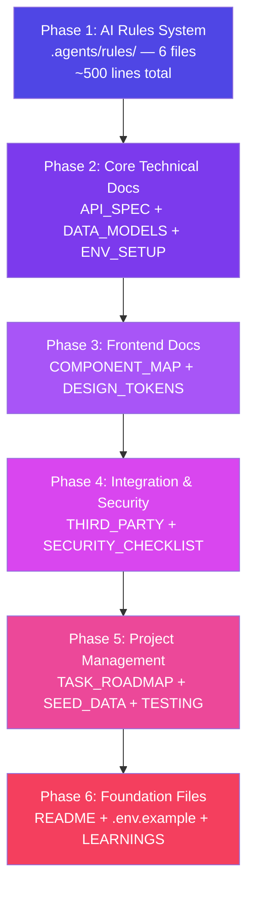

# Sudemy — Vibe Coding Documentation Preparation Plan

> **Goal:** Build a complete documentation set so AI agents (Antigravity/Gemini) deeply understand project context, coding standards, and business logic — maximizing vibe coding efficiency.
>
> **Scope:** V1 MVP first. V2 docs added incrementally later.
>
> **Language:** All documentation in English (AI processes English most accurately).

---

## Key Principles (From Top Developer Practices)

> [!IMPORTANT]
> These principles guide how we write every document:

| Principle | Description |
|---|---|
| **Concise Rules** | Each rule file ≤ 100 lines. Move details to `docs/` and reference them. |
| **Actionable over Descriptive** | Write executable instructions, not essays. Use "Bad vs Correct" code examples. |
| **Progressive Disclosure** | Root-level rules are concise summaries. Linked docs have full details. |
| **Start Simple, Iterate** | Don't over-optimize rules early. Add rules only when AI makes repeated mistakes. |
| **Reference, Don't Copy** | Point to canonical examples in repo rather than pasting code into rules. |
| **Explicit Constraints** | "NEVER" rules must be prominent and unambiguous. |
| **Feedback Loop** | `LEARNINGS.md` captures what AI gets wrong → feeds back into rules. |

---

## Document Structure Overview

```
Sudemy/
├── .agents/rules/                    # AI Agent Rules (concise, actionable)
│   ├── rule.md                       # Router — @import all rule files
│   ├── architecture.md               # System architecture & boundaries
│   ├── coding-standards.md           # Conventions, naming, constraints
│   ├── frontend-guide.md             # React/UI patterns & "never" rules
│   ├── backend-guide.md              # Express/API patterns & "never" rules
│   └── workflow.md                   # Git, task execution, feedback loop
│
├── docs/                             # Detailed reference docs (linked from rules)
│   ├── API_SPECIFICATION.md          # All API endpoints with schemas
│   ├── DATA_MODELS.md                # MongoDB schemas + relationships + indexes
│   ├── COMPONENT_MAP.md              # React component tree + props
│   ├── DESIGN_TOKENS.md              # Colors, typography, spacing, animations
│   ├── SEED_DATA.md                  # Dev data for all collections
│   ├── ENVIRONMENT_SETUP.md          # Setup guide + .env reference
│   ├── SECURITY_CHECKLIST.md         # Security requirements consolidated
│   ├── THIRD_PARTY_INTEGRATION.md    # Firebase, PayOS, Resend integration guides
│   └── TESTING_STRATEGY.md           # Test plan, mocks, coverage targets
│
├── .env.example                      # Environment variables template
├── LEARNINGS.md                      # Feedback loop — lessons learned per session
├── TASK_ROADMAP.md                   # Sprint/milestone breakdown
├── PROJECT_BRIEF_V1_MVP_EN.md        # ✅ Already exists
├── PROJECT_BRIEF_V2_UPGRADE_EN.md    # ✅ Already exists
└── README.md                         # Quick start + doc index
```

---

## Group 1: AI Rules System (`.agents/rules/`)

> [!IMPORTANT]
> The most critical group — determines whether AI understands context correctly.
> Each file MUST stay ≤ 100 lines. Be surgical, not verbose.

---

### [NEW] `.agents/rules/rule.md` — Router File

**Purpose:** Main entry point. Imports all rule files. Trigger: `always_on`.

**Content structure:**
```markdown
---
trigger: always_on
---

# Sudemy — AI Agent Context

## Project Identity (3-4 sentences)
Sudemy is a Vietnamese LMS for practical AI tool courses.
Monolithic architecture: React 19 SPA (Vite) + Express.js API + MongoDB Atlas.
Key differentiator: Free AI Prompt Library (SEO lead magnet) + white-label support.
See PROJECT_BRIEF_V1_MVP_EN.md for full spec.

## Critical Commands
- Install: `cd client && npm i && cd ../server && npm i`
- Dev (client): `cd client && npm run dev`
- Dev (server): `cd server && npm run dev`
- Test: `cd server && npm test`
- Lint: `npm run lint`

## Document Index
- Full API spec → docs/API_SPECIFICATION.md
- Data models → docs/DATA_MODELS.md
- Component map → docs/COMPONENT_MAP.md
- Design tokens → docs/DESIGN_TOKENS.md

@import architecture.md
@import coding-standards.md
@import frontend-guide.md
@import backend-guide.md
@import workflow.md
```

---

### [NEW] `.agents/rules/architecture.md` — System Architecture

**Must include (~80 lines):**
- Architecture diagram (text-based): `Client (Vercel) → API (Render) → MongoDB Atlas`
- Auth flow: `Firebase Auth → Backend verifyIdToken → req.user`
- Payment flow: `Client → POST /api/v1/orders → PayOS → Webhook → unlock course`
- Folder structure summary (client/ & server/)
- Database collections list (names only, link to DATA_MODELS.md for details)
- Deployment topology
- **NEVER rules:**
  - "NEVER store secrets in client-side code"
  - "NEVER bypass Firebase token verification"
  - "NEVER access MongoDB directly from client"

---

### [NEW] `.agents/rules/coding-standards.md` — Conventions & Constraints

**Must include (~80 lines):**
- Language: TypeScript strict mode (both FE & BE)
- Naming conventions table (files, variables, types, models)
- Import order: Node built-in → External → Internal → Types
- **Bad vs Correct examples** (2-3 pairs):

```typescript
// ❌ Bad: Magic strings, no types
const role = "admin"
if (user.role === role) { ... }

// ✅ Correct: Enum, typed
enum UserRole { USER = 'user', ADMIN = 'admin', EDITOR = 'editor', MODERATOR = 'moderator' }
if (user.role === UserRole.ADMIN) { ... }
```

- Validation: Always Zod. Share schemas between FE/BE when possible.
- **NEVER rules:**
  - "NEVER use `any` type — use `unknown` and narrow"
  - "NEVER use `console.log` in production code — use structured logger"
  - "NEVER commit `.env` files"
  - "NEVER use string concatenation for MongoDB queries"

---

### [NEW] `.agents/rules/frontend-guide.md` — React/UI Patterns

**Must include (~80 lines):**
- Functional components + hooks only. No class components.
- Styling: TailwindCSS v4 + shadcn/ui. Custom CSS only when absolutely necessary.
- State: TanStack Query for server state, React Context for auth/theme/settings.
- Forms: React Hook Form + Zod resolver.
- Routing: React Router v7, lazy load all pages.
- Dark/Light mode: CSS variables + ThemeProvider context.
- Responsive: Mobile-first. Breakpoints: sm(640), md(768), lg(1024), xl(1280).
- Animation: Framer Motion — subtle, purposeful only.
- Component naming: `[Feature][Type].tsx` → `CourseCard.tsx`, `PromptFilter.tsx`
- Page naming: `[PageName]Page.tsx` → `LandingPage.tsx`
- **NEVER rules:**
  - "NEVER use inline styles"
  - "NEVER fetch data in useEffect — use TanStack Query"
  - "NEVER store sensitive data in localStorage"

---

### [NEW] `.agents/rules/backend-guide.md` — Express/API Patterns

**Must include (~80 lines):**
- 3-layer: Route → Controller → Service → Model
- All routes prefixed `/api/v1/`
- Request flow: `Route → Middleware(auth, validate) → Controller → Service → Response`
- Standard response format (with example):
```json
// Success
{ "success": true, "data": { ... }, "message": "Course created" }
// Error
{ "success": false, "error": { "code": "COURSE_NOT_FOUND", "message": "..." } }
// Paginated
{ "success": true, "data": [...], "pagination": { "page": 1, "limit": 20, "total": 100, "totalPages": 5 } }
```
- Middleware stack order: cors → helmet → rate-limit → json → routes → errorHandler
- Auth middleware: `verifyFirebaseToken` → attaches `req.user`
- Role middleware: `requireRole('admin', 'editor')` — generic, reusable
- Slug auto-generation from title (unique constraint)
- Error handling: Custom `AppError` class, centralized error handler
- **NEVER rules:**
  - "NEVER send raw MongoDB errors to client"
  - "NEVER skip input validation"
  - "NEVER handle payments without idempotency keys"

---

### [NEW] `.agents/rules/workflow.md` — Development Workflow

**Must include (~60 lines):**
- Task execution order: **Always Backend first → Frontend second** per feature
- Branch naming: `feat/`, `fix/`, `refactor/`, `docs/`
- Commit format: Conventional Commits (`feat:`, `fix:`, `chore:`)
- Before submitting work: types checked, tests pass, no console.log, env vars documented
- After each task: update `LEARNINGS.md` with discoveries
- Plan-Act-Reflect loop:
  1. **Plan:** Read relevant docs, propose approach
  2. **Act:** Implement with tests
  3. **Reflect:** Update LEARNINGS.md, refine rules if needed
- New sessions for distinct features (keep context clean)

---

## Group 2: Detailed Reference Docs (`docs/`)

### [NEW] `docs/API_SPECIFICATION.md`

> [!IMPORTANT]
> The longest and most critical document for backend development.

**Format for EACH endpoint:**

```markdown
### POST /api/v1/auth/register
- **Auth:** None
- **Body:** `{ fullName: string, email: string, password: string }`
- **Validation:** fullName (letters+spaces, Vietnamese Unicode), email (valid format), password (min 8, 1 upper, 1 lower, 1 number)
- **Success (201):** `{ success: true, data: { user: {...}, token: "..." } }`
- **Errors:** 400 (validation), 409 (email exists)
- **Logic:** Create Firebase user → Create MongoDB user doc → Return JWT
```

**Full endpoint list grouped by module:**

| Module | Endpoints |
|---|---|
| **Auth & Users** | register, login, me, update role (admin), list users (admin) |
| **Courses** | list (public, filtered, paginated), get by slug, create, update, delete |
| **Lessons** | list by course, get by id, create, update, delete, submit quiz |
| **Prompts** | list (filtered by tags), get by slug, create, update, delete, increment copy |
| **Tags** | list, create, update, delete |
| **Orders & Payments** | create order (→ PayOS), list (admin), my orders, PayOS webhook |
| **Coupons** | list (admin), create, update, delete, validate |
| **Flash Sales** | get active (public), list (admin), create, update |
| **Progress & Certificates** | get progress, mark complete, list certificates, verify certificate |
| **Tickets** | create, list (admin), my tickets, reply, update status |
| **Settings** | get (public, white-label), update (admin) |
| **Admin Stats** | dashboard stats (revenue, orders, students) |

**Total: ~40 endpoints**

---

### [NEW] `docs/DATA_MODELS.md`

Expands Section 9 of Project Brief. For each of the 11 collections:
- Field names with **exact TypeScript types**
- Required vs optional markers
- Default values
- Indexes (unique, compound, text search)
- Pre-save hooks (slug generation, timestamps)
- Relationships diagram (Mermaid ERD)
- Validation rules at model level

---

### [NEW] `docs/COMPONENT_MAP.md`

Complete React component tree organized by area:

| Area | Components |
|---|---|
| **Layout** | Header, Footer, Sidebar, AdminLayout, StudentLayout, ThemeToggle |
| **Shared** | CourseCard, PromptCard, TagBadge, Pagination, SearchBar, LoadingSpinner, EmptyState, ConfirmDialog |
| **Landing** | HeroSection, FeaturedCourses, StatsSection, TestimonialSlider, FlashSaleBanner |
| **Courses** | CourseFilter, CourseGrid, CourseDetail, LessonList, ReviewSection |
| **Prompts** | PromptFilter, PromptGrid, PromptDetail, CopyButton |
| **Player** | VideoPlayer, LessonSidebar, QuizModal, ProgressBar, LessonNavigation |
| **Dashboard** | MyCourses, OrderHistory, CertificateList, ProgressOverview |
| **Admin** | StatsCard, DataTable, RichTextEditor, ImageUploader, StatusBadge, CouponForm, FlashSaleForm |

Each component: name, description, props interface, API dependencies.

---

### [NEW] `docs/DESIGN_TOKENS.md`

- **Color palette:** Primary, secondary, accent (HSL values), semantic colors, dark mode palette, gray scale
- **Typography:** Inter (headings) + Be Vietnam Pro (body), size scale, weights, line heights
- **Spacing:** 4px base unit system
- **Border radius, shadows, z-index** scales
- **Animation tokens:** Framer Motion duration/easing presets
- **Breakpoints:** Mobile-first values
- **Inspiration:** Linear, Vercel, Stripe aesthetic (clean, premium, modern)

---

### [NEW] `docs/SEED_DATA.md`

Realistic Vietnamese seed data:
- **Users:** 1 Super Admin, 1 Editor, 1 Moderator, 5 Students
- **Courses:** 3-5 AI tool courses (NanoBanana, ChatGPT, Canva AI) with 5-8 lessons each
- **Prompts:** 15-20 prompts with diverse tool/purpose tags
- **Tags:** 10-15 tags (mix of tool & purpose types)
- **Testimonials:** 20 realistic Vietnamese-name reviews
- **Settings:** Default white-label config
- **Coupons:** 2-3 sample coupons
- Seed script location: `server/src/scripts/seed.ts`

---

### [NEW] `docs/ENVIRONMENT_SETUP.md`

- Prerequisites (Node.js version, package manager)
- Step-by-step setup instructions
- Every `.env` variable explained with example values
- Third-party account setup (MongoDB Atlas, Firebase, PayOS, Resend, GA4)
- Running dev servers (concurrent client + server)
- Common issues & troubleshooting

---

### [NEW] `docs/THIRD_PARTY_INTEGRATION.md`

For each service — init code, key functions, error handling, test/sandbox mode:

| Service | Integration Details |
|---|---|
| **Firebase Auth** | Admin SDK init, verifyIdToken middleware, Google Sign-in flow, error codes |
| **PayOS** | Create payment link, webhook handler, signature verification, idempotency |
| **Resend** | Send email utility, HTML email templates, error handling |
| **YouTube Embed** | URL parsing → video ID extraction, embed parameters |
| **Google Analytics 4** | Init script, custom events (course_purchase, prompt_copy, lesson_complete) |

---

### [NEW] `docs/SECURITY_CHECKLIST.md`

Checkbox-format checklist consolidating all security requirements from Project Brief Section 5:
- Input validation rules (Zod schemas)
- Required libraries (DOMPurify, mongo-sanitize, helmet, rate-limit)
- Payment security (webhook signature, idempotency)
- CORS configuration
- Rate limiting per endpoint
- Environment variable handling

---

### [NEW] `docs/TESTING_STRATEGY.md`

- Backend: Jest + Supertest (API endpoint tests)
- Frontend: Vitest + React Testing Library (component + hook tests)
- Test naming conventions
- Mock strategy: Firebase Admin, PayOS, Resend
- Factory functions for test data
- Coverage target: >80% for services & controllers
- E2E (later): Playwright for critical flows

---

## Group 3: Project Management Files

### [NEW] `TASK_ROADMAP.md`

6 milestones, each with concrete deliverables:

| Milestone | Content | Approach |
|---|---|---|
| **M0: Foundation** | Project init, folder structure, env, MongoDB connection, Firebase init | Setup session |
| **M1: Auth & Users** | Register, login, Firebase middleware, role-based access, user management | BE → FE |
| **M2: Prompts & Tags** | Tag CRUD, Prompt CRUD, SEO pages, copy count, filtering | BE → FE |
| **M3: Courses & Lessons** | Course CRUD, Lesson CRUD, quiz, progress tracking, certificates | BE → FE |
| **M4: Payments** | PayOS integration, orders, webhook, coupons, flash sales | BE → FE |
| **M5: Admin & Polish** | Dashboard stats, white-label settings, tickets, email, landing page | BE → FE |

---

### [NEW] `LEARNINGS.md`

Persistent feedback loop. Template:
```markdown
# Learnings & Decisions Log

## [Date] — [Feature/Topic]
**Problem:** What went wrong or was unexpected
**Solution:** How it was resolved
**Rule Update:** Any rule file changes made as a result
```

---

### [NEW/UPDATE] `.env.example`

All environment variables with descriptions and example (non-sensitive) values.

---

### [NEW/UPDATE] `README.md`

Project overview, tech stack, quick start (3 commands), link index to all docs.

---

## User Review Required

> [!IMPORTANT]
> Decisions to confirm before execution:

1. **TypeScript or JavaScript?** — Project Brief shows `vite.config.js` but I strongly recommend **TypeScript** for both FE & BE. AI agents produce much more accurate code with type information. Agree?

2. **State Management:** TanStack Query (server state) + React Context (auth/theme) — or just React Context for everything?

3. **Rules location:** Use existing `.agents/rules/` directory (already in project) or create `.gemini/rules/`? If you use multiple AI tools, `.agents/rules/` is more tool-agnostic.

4. **Seed data realism:** Create realistic Vietnamese AI course content (mimicking actual NanoBanana/ChatGPT tutorials) or generic placeholder content?

## Open Questions

> [!WARNING]
> Need additional information:

- **PayOS:** Do you have a sandbox account already? Need API keys for integration guide.
- **Firebase:** Project already created, or should we create fresh during setup?
- **Design:** Any existing mockups/wireframes, or should AI design based on Linear/Vercel/Stripe inspiration?

---

## Execution Order



> **Total:** ~17 files to create. After approval, I'll execute phase by phase.

---

## Verification Plan

### Automated
- All TypeScript types compile successfully
- Seed data script runs without errors
- API routes in spec match actual route files

### Manual
- Cross-reference between docs for consistency
- Test AI agent effectiveness: ask it to implement a small feature, verify docs provide sufficient context
