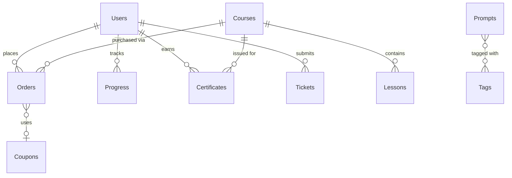

# Data Models — MongoDB Schemas

> All collections use Mongoose. Timestamps auto-managed.
> All `slug` fields have unique indexes, auto-generated from `title`/`name`.

---

## Relationships Diagram



---

## Users
```typescript
interface IUser {
  _id: ObjectId;
  firebaseUid: string;       // Unique, indexed
  fullName: string;           // 2-50 chars, Vietnamese Unicode
  email: string;              // Unique, indexed, lowercase
  role: 'user' | 'editor' | 'moderator' | 'admin'; // Default: 'user'
  purchasedCourses: ObjectId[];
  createdAt: Date;
  updatedAt: Date;
}
// Indexes: { firebaseUid: 1 } unique, { email: 1 } unique, { role: 1 }
```

## Courses
```typescript
interface ICourse {
  _id: ObjectId;
  title: string;              // 3-200 chars
  slug: string;               // Unique, auto-generated
  description: string;        // Min 10 chars, sanitized HTML
  thumbnail: string;          // URL
  price: number;              // ≥ 0 (0 = free)
  originalPrice?: number;
  instructor: string;
  status: 'draft' | 'published' | 'archived'; // Default: 'draft'
  totalLessons: number;       // Auto-calculated
  previewLessons: number;     // Default: 2
  ratings: { average: number; count: number; };
  createdAt: Date;
  updatedAt: Date;
}
// Indexes: { slug: 1 } unique, { status: 1 }, { title: 'text', description: 'text' }
```

## Lessons
```typescript
interface ILesson {
  _id: ObjectId;
  courseId: ObjectId;          // Ref: Course
  title: string;
  slug: string;               // Unique within course
  youtubeUrl: string;
  order: number;              // Unique within course
  isFree: boolean;            // Default: false
  quiz: { question: string; options: string[]; correctAnswer: number; }[];
  createdAt: Date;
  updatedAt: Date;
}
// Indexes: { courseId: 1, order: 1 }, { courseId: 1, slug: 1 } unique
```

## Prompts
```typescript
interface IPrompt {
  _id: ObjectId;
  title: string;
  slug: string;               // Unique (SEO URL)
  content: string;            // The prompt text
  description: string;        // Meta description
  tags: ObjectId[];           // Ref: Tag
  category: string;
  copyCount: number;          // Default: 0
  createdAt: Date;
  updatedAt: Date;
}
// Indexes: { slug: 1 } unique, { tags: 1 }, { title: 'text', content: 'text' }
```

## Tags
```typescript
interface ITag {
  _id: ObjectId;
  name: string;               // Unique, 2-50 chars
  slug: string;               // Unique
  type: 'tool' | 'purpose';
  color?: string;             // Hex color for badge
}
// Indexes: { slug: 1 } unique, { type: 1 }, { name: 1 } unique
```

## Orders
```typescript
interface IOrder {
  _id: ObjectId;
  userId: ObjectId;
  courseId: ObjectId;
  amount: number;             // Final paid
  originalAmount: number;     // Before discount
  couponId?: ObjectId;
  payosOrderId: string;
  payosTransactionId?: string;
  status: 'pending' | 'completed' | 'failed'; // Default: 'pending'
  idempotencyKey: string;     // Unique
  createdAt: Date;
}
// Indexes: { userId: 1 }, { payosOrderId: 1 } unique, { idempotencyKey: 1 } unique
```

## Coupons
```typescript
interface ICoupon {
  _id: ObjectId;
  code: string;               // Unique, alphanumeric, uppercase
  discountType: 'percent' | 'fixed';
  discountValue: number;
  maxUses?: number;
  usedCount: number;          // Default: 0
  expiresAt?: Date;
  isActive: boolean;          // Default: true
  createdAt: Date;
}
// Indexes: { code: 1 } unique
```

## FlashSales
```typescript
interface IFlashSale {
  _id: ObjectId;
  name: string;
  discountPercent: number;    // 1-99
  startTime: Date;
  endTime: Date;
  isActive: boolean;          // Default: true
  createdAt: Date;
}
// Indexes: { isActive: 1, startTime: 1, endTime: 1 }
```

## Tickets
```typescript
interface ITicket {
  _id: ObjectId;
  userId: ObjectId;
  subject: string;            // 5-200 chars
  message: string;            // 10-2000 chars
  status: 'new' | 'processing' | 'resolved'; // Default: 'new'
  replies: { message: string; repliedBy: ObjectId; repliedAt: Date; }[];
  createdAt: Date;
}
// Indexes: { userId: 1 }, { status: 1, createdAt: -1 }
```

## Certificates
```typescript
interface ICertificate {
  _id: ObjectId;
  userId: ObjectId;
  courseId: ObjectId;
  verificationCode: string;   // Unique, 8-char alphanumeric
  issuedAt: Date;
}
// Indexes: { verificationCode: 1 } unique, { userId: 1, courseId: 1 } unique
```

## Progress
```typescript
interface IProgress {
  _id: ObjectId;
  userId: ObjectId;
  courseId: ObjectId;
  lessonId: ObjectId;
  completed: boolean;         // Default: false
  quizScore?: number;
  completedAt?: Date;
}
// Indexes: { userId: 1, courseId: 1 }, { userId: 1, courseId: 1, lessonId: 1 } unique
```

## Settings (Singleton)
```typescript
interface ISettings {
  _id: ObjectId;
  platformName: string;       // Default: 'Sudemy'
  logoUrl: string;
  faviconUrl: string;
  primaryColor: string;       // Hex, default: '#4f46e5'
  contactEmail: string;
  socialLinks: { facebook?: string; youtube?: string; tiktok?: string; zalo?: string; };
  footerText: string;
  updatedAt: Date;
}
// Note: Only ONE document (singleton). Pre-seed on first deploy.
```

---

## Pre-Save Hooks

```typescript
// Slug generation (Course, Lesson, Prompt, Tag)
schema.pre('save', async function(next) {
  if (this.isModified('title') || this.isModified('name')) {
    let baseSlug = slugify(this.title || this.name, { lower: true, strict: true });
    let slug = baseSlug;
    let counter = 1;
    while (await this.constructor.findOne({ slug, _id: { $ne: this._id } })) {
      slug = `${baseSlug}-${++counter}`;
    }
    this.slug = slug;
  }
  next();
});
```
