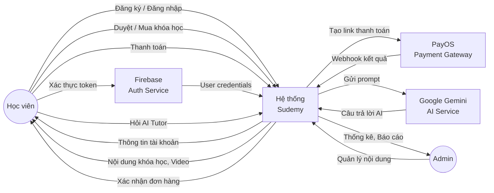
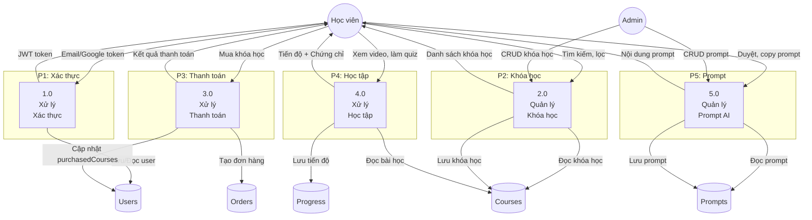
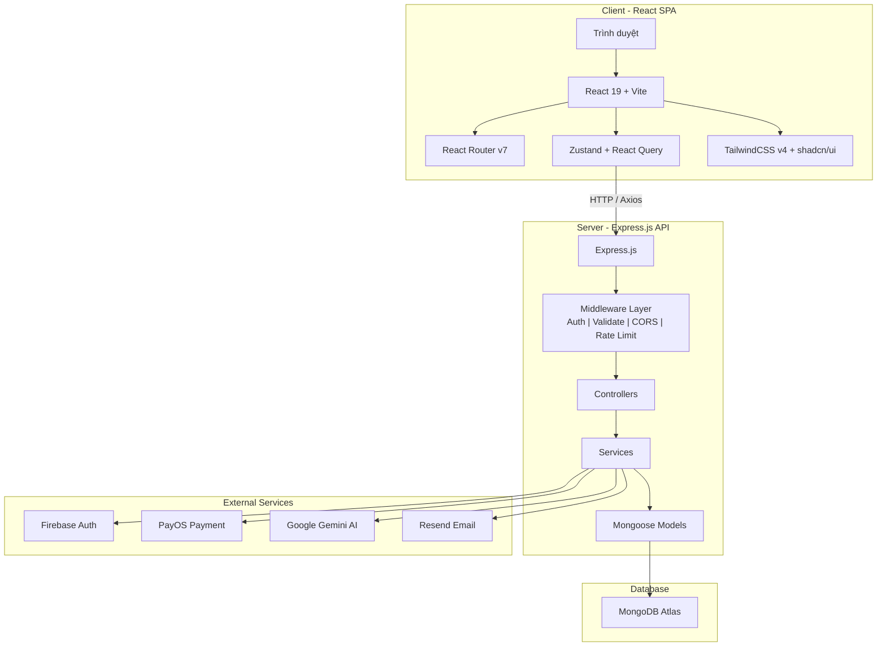

## Chương II. KIẾN THỨC ÁP DỤNG

### 2.1 Phân tích & thiết kế hệ thống

#### 2.1.1 Biểu đồ phân cấp chức năng (BFD — Business Function Diagram)

```mermaid
graph TD
    A["Hệ thống Sudemy<br/>Bán khóa học online"] --> B["Quản lý Tài khoản"]
    A --> C["Quản lý Khóa học<br/>& Nội dung"]
    A --> D["Quản lý Thanh toán<br/>& Đơn hàng"]
    A --> E["Quản trị Hệ thống"]
    A --> F["Thư viện Prompt AI"]

    B --> B1["Đăng ký tài khoản"]
    B --> B2["Đăng nhập<br/>Email / Google"]
    B --> B3["Quản lý hồ sơ"]
    B --> B4["Phân quyền<br/>User / Editor / Mod / Admin"]

    C --> C1["Duyệt khóa học"]
    C --> C2["Xem chi tiết<br/>khóa học"]
    C --> C3["Học bài<br/>Video Player"]
    C --> C4["Làm Quiz"]
    C --> C5["Theo dõi tiến độ"]
    C --> C6["Nhận chứng chỉ"]
    C --> C7["CRUD Khóa học<br/>Admin"]
    C --> C8["CRUD Bài học<br/>Admin"]

    D --> D1["Tạo đơn hàng"]
    D --> D2["Thanh toán PayOS<br/>QR / Chuyển khoản"]
    D --> D3["Áp dụng Coupon"]
    D --> D4["Flash Sale"]
    D --> D5["Xem lịch sử<br/>đơn hàng"]

    E --> E1["Dashboard<br/>Thống kê"]
    E --> E2["Quản lý<br/>Người dùng"]
    E --> E3["Quản lý<br/>Ticket hỗ trợ"]
    E --> E4["Cài đặt<br/>White-label"]

    F --> F1["Duyệt Prompt"]
    F --> F2["Lọc theo Tag"]
    F --> F3["Copy Prompt"]
    F --> F4["CRUD Prompt<br/>Admin"]
```

#### 2.1.2 Biểu đồ luồng dữ liệu (DFD — Data Flow Diagram)

**DFD Level 0 — Context Diagram:**

**DFD Level 1 — Chi tiết các process:**

---

### 2.2 Kiến trúc hệ thống

Hệ thống Sudemy sử dụng kiến trúc **Monolithic** với mô hình **Client-Server**, giao tiếp qua **RESTful API**:

**Giải thích kiến trúc:**
- **Frontend (Client):** React 19 SPA chạy trên trình duyệt, sử dụng Vite làm build tool, React Router cho điều hướng, Zustand + React Query cho state management.
- **Backend (Server):** Express.js API xử lý business logic, sử dụng middleware pipeline (Auth → Validate → Controller → Service → Response).
- **Database:** MongoDB Atlas (NoSQL) lưu trữ dữ liệu trên cloud.
- **External Services:** Firebase Auth (xác thực), PayOS (thanh toán), Google Gemini (AI Tutor), Resend (email).

---

### 2.3 Cơ sở dữ liệu

Hệ thống sử dụng **MongoDB Atlas** — cơ sở dữ liệu NoSQL dạng document, với **Mongoose** làm ODM (Object Document Mapping).

**Lý do chọn MongoDB (NoSQL) thay vì SQL:**

| Tiêu chí | MongoDB (NoSQL) | SQL (MySQL/PostgreSQL) |
|----------|-----------------|------------------------|
| **Schema** | Flexible schema — phù hợp với dữ liệu khóa học có cấu trúc đa dạng (quiz, bài học, prompt) | Cứng nhắc, cần migration khi thay đổi |
| **Hiệu năng đọc** | Nhanh hơn cho read-heavy workload (LMS chủ yếu đọc) | Tốt cho write-heavy với transactions phức tạp |
| **Embedded documents** | Quiz questions nhúng trực tiếp trong Lesson, giảm số lần query | Cần JOIN nhiều bảng |
| **Scalability** | Horizontal scaling dễ dàng | Vertical scaling là chính |
| **Free Tier** | MongoDB Atlas Free 512MB — đủ cho MVP | Cần hosting riêng |

---

### 2.4 Ngôn ngữ lập trình & công nghệ

| Công nghệ | Phiên bản | Vai trò |
|-----------|-----------|---------|
| **React** | 19 | Thư viện UI, xây dựng giao diện SPA |
| **TypeScript** | 5.x | Ngôn ngữ lập trình (backend), type safety |
| **JavaScript** | ES2024 | Ngôn ngữ lập trình (frontend) |
| **Vite** | 8 | Build tool, dev server cho React |
| **TailwindCSS** | v4 | CSS utility-first framework |
| **shadcn/ui** | Latest | Component library (Button, Input, Modal, DataTable) |
| **Express.js** | 4 | Web framework cho Node.js (REST API) |
| **Mongoose** | 8 | ODM cho MongoDB |
| **Firebase Auth** | Admin SDK | Xác thực người dùng (Email + Google OAuth) |
| **PayOS** | @payos/node v2 | Cổng thanh toán nội địa Việt Nam |
| **Google Gemini** | @google/genai v2 | AI Tutor chatbot |
| **React Query** | TanStack v5 | Server state management, caching |
| **Zustand** | Latest | Client state management |
| **React Hook Form** | Latest | Form management |
| **Zod** | v4 | Schema validation (cả FE + BE) |
| **Framer Motion** | v12 | Animations |
| **Recharts** | v3 | Biểu đồ thống kê (Admin dashboard) |
| **Winston** | v3 | Logging (backend) |
| **Helmet** | Latest | HTTP security headers |
