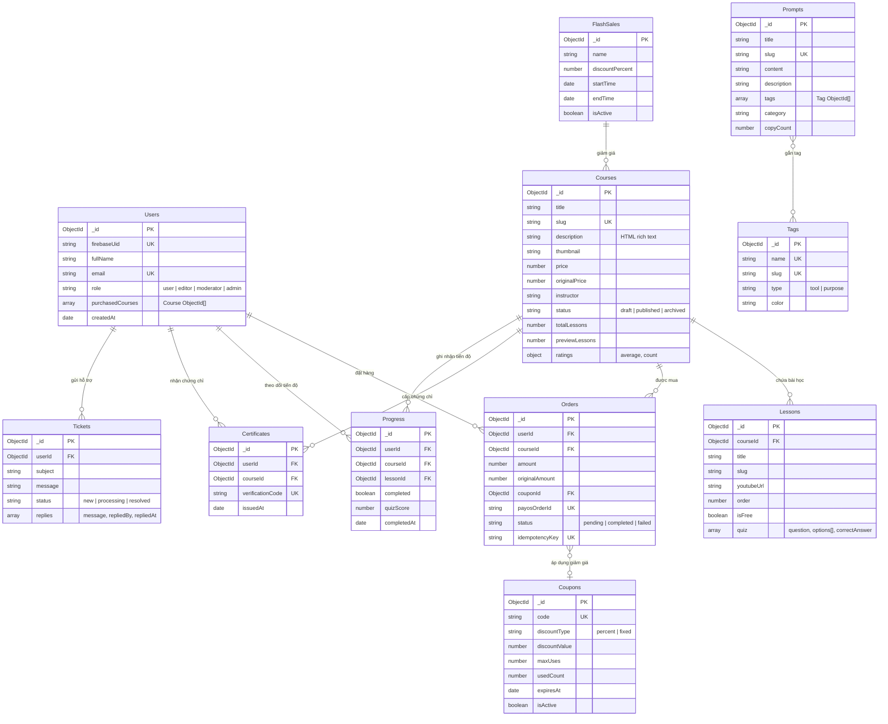
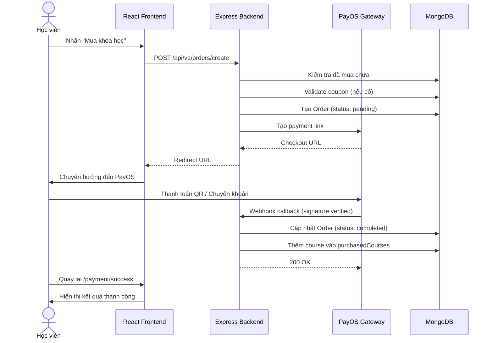

## Chương III. PHÂN TÍCH THIẾT KẾ CHI TIẾT

### 3.1 Phân tích thiết kế CSDL

#### 3.1.1 Sơ đồ quan hệ giữa các Collections (ERD)

#### 3.1.2 Chi tiết các Collections

Hệ thống gồm **11 collections** chính trong MongoDB:

| # | Collection | Mô tả | Indexes |
|---|-----------|-------|---------|
| 1 | **Users** | Tài khoản người dùng, liên kết Firebase Auth | `firebaseUid` (unique), `email` (unique), `role` |
| 2 | **Courses** | Catalog khóa học | `slug` (unique), `status`, text index (title + description) |
| 3 | **Lessons** | Bài học trong khóa học, chứa quiz embedded | `courseId + order`, `courseId + slug` (unique) |
| 4 | **Prompts** | Thư viện Prompt AI (SEO pages) | `slug` (unique), `tags`, text index (title + content) |
| 5 | **Tags** | Tag phân loại prompt (theo tool + mục đích) | `slug` (unique), `type`, `name` (unique) |
| 6 | **Orders** | Đơn hàng mua khóa học | `userId`, `payosOrderId` (unique), `idempotencyKey` (unique) |
| 7 | **Coupons** | Mã giảm giá | `code` (unique) |
| 8 | **FlashSales** | Sự kiện giảm giá toàn nền tảng | `startTime`, `endTime` |
| 9 | **Tickets** | Ticket hỗ trợ từ học viên | `userId`, `status` |
| 10 | **Certificates** | Chứng chỉ hoàn thành khóa học | `verificationCode` (unique), `userId + courseId` (unique) |
| 11 | **Progress** | Tiến độ học tập từng bài | `userId + courseId`, `userId + courseId + lessonId` (unique) |

---

### 3.2 Phân tích thiết kế chức năng

#### 3.2.1 API Endpoints

Hệ thống cung cấp **RESTful API** với base URL `/api/v1`, xác thực bằng Firebase ID Token trong header `Authorization: Bearer <token>`.

**Tổng quan API theo nhóm chức năng:**

| Nhóm | Số endpoints | Mô tả |
|------|-------------|-------|
| Auth & Users | 5 | Đăng ký, đăng nhập, profile, phân quyền |
| Courses | 6 | CRUD khóa học, thay đổi trạng thái |
| Lessons | 6 | CRUD bài học, nộp quiz |
| Prompts | 6 | CRUD prompt, tăng số lần copy |
| Tags | 4 | CRUD tags |
| Orders & Payments | 4 | Tạo đơn hàng, webhook PayOS |
| Coupons | 5 | CRUD mã giảm giá, validate |
| Flash Sales | 4 | CRUD flash sale |
| Progress & Certificates | 4 | Tiến độ học, cấp chứng chỉ |
| Tickets | 5 | CRUD ticket hỗ trợ |
| Settings | 2 | Đọc/sửa cài đặt nền tảng |
| Admin Stats | 1 | Thống kê dashboard |
| **Tổng** | **~52** | |

#### 3.2.2 Middleware Pipeline

Mỗi request đi qua pipeline middleware trước khi đến Controller:

```mermaid
graph LR
    Request["HTTP Request"] --> CORS["CORS"]
    CORS --> Helmet["Helmet<br/>Security Headers"]
    Helmet --> RateLimit["Rate Limiter<br/>100 req/15min"]
    RateLimit --> Sanitize["Mongo Sanitize<br/>Chống NoSQL Injection"]
    Sanitize --> Auth["Auth Middleware<br/>Verify Firebase Token"]
    Auth --> Validate["Validate Middleware<br/>Zod Schema"]
    Validate --> Controller["Controller"]
    Controller --> Service["Service Layer"]
    Service --> Model["Mongoose Model"]
    Model --> DB["MongoDB"]
    DB --> Response["HTTP Response"]
```

#### 3.2.3 Luồng thanh toán khóa học

---

### 3.3 Các chức năng chưa làm được

Do giới hạn thời gian của dự án MVP, một số chức năng dự kiến chưa được triển khai:

| Chức năng | Mô tả | Lý do chưa làm |
|-----------|-------|----------------|
| **Subscription Plans** | Gói Pro tháng/năm cho học viên | Cần xây dựng hệ thống billing phức tạp |
| **Hệ thống Affiliate** | Chương trình giới thiệu, hoa hồng | Cần tracking link + hệ thống tính hoa hồng |
| **AI Coin Gamification** | Hệ thống tích điểm, phần thưởng | Cần thiết kế game mechanics |
| **Live Chat** | Tích hợp Telegram / Zalo | Cần API bên thứ 3 |
| **Custom Domain** | Cho phép admin dùng tên miền riêng | Cần cấu hình DNS + SSL phức tạp |
